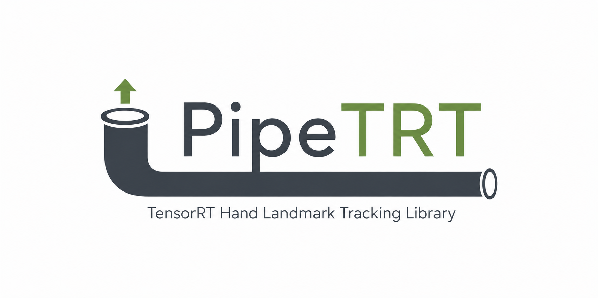

  

  MediaPipe-inspired TensorRT hand landmark library for NVIDIA GPUs

  
  
  

MediaPipe-inspired TensorRT hand landmark library for NVIDIA GPUs

## dev branch
このブランチは、pipeTRTのapi,landmark,palm,roi,trackingをまとめ、TensorRTで総合的推論を行うための作業場です。 
プレリリースで動くやつを乗せることもありますが動くことしか確認していないため安定性は保証しません。
安定性も十分なものは、mainやリリースから確認してください。

## demo 0.1.0

## Issue
問題があればmainか、修正したほうがいい場所が分かってる場合はそのブランチ内のissueを切ってください！ 区切りがついたら修正します。